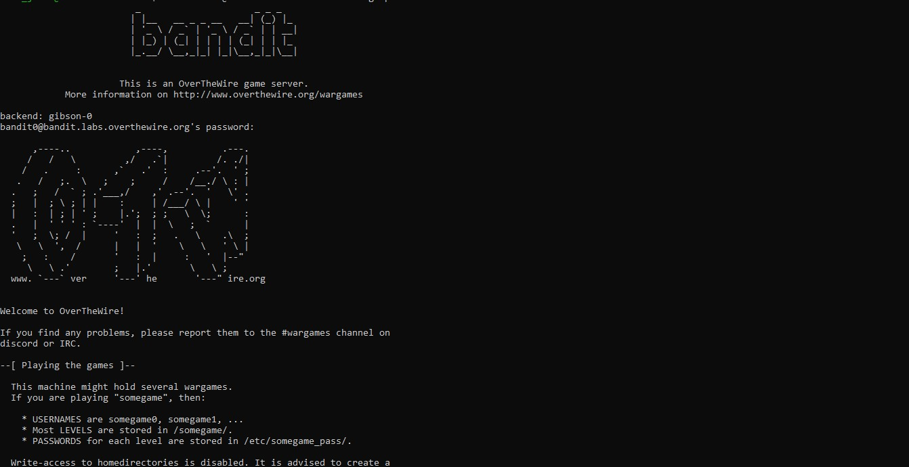
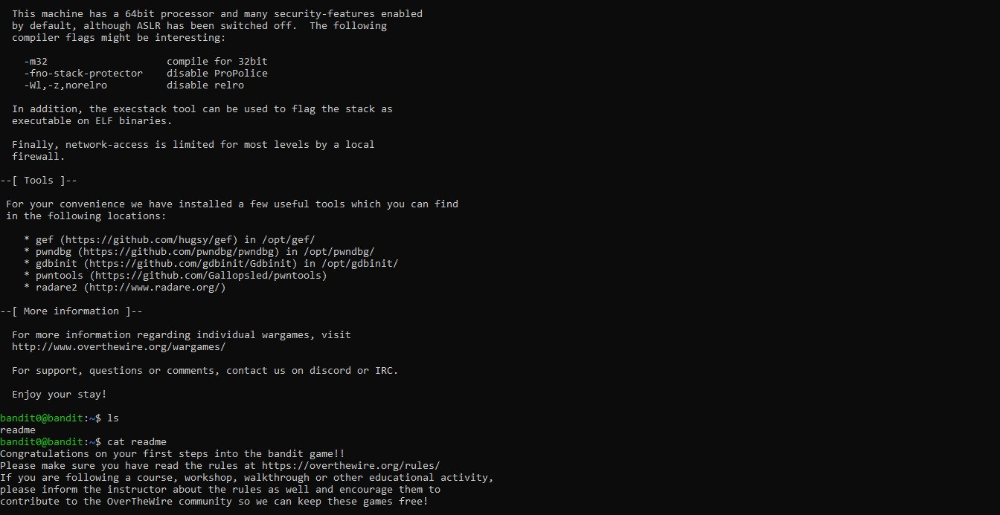

# Bandit Level 0 → Level 1

## Objective

The objective of this level is to establish a secure SSH connection to the Bandit server and retrieve the password required to access the next level. This introductory challenge demonstrates how to connect to a remote Linux system using SSH and execute basic terminal commands.

---

## Challenge Information

| Item | Value |
|------|-------|
| Game | OverTheWire Bandit |
| Level | 0 → 1 |
| Host | `bandit.labs.overthewire.org` |
| Port | `2220` |
| Username | `bandit0` |
| Password | **Redacted** |

> **Note:** The password has been intentionally omitted to respect the OverTheWire Bandit rules and avoid publishing challenge spoilers.

---

## Prerequisites

Before attempting this level, ensure you have:

- A terminal (Linux, macOS, WSL, or Git Bash)
- An SSH client installed
- Internet connectivity

---

## Skills Learned

- Connecting to a remote Linux server using SSH
- Understanding SSH authentication
- Executing commands on a remote machine
- Listing directory contents using `ls`
- Viewing file contents using `cat`

---

## Commands Used

### 1. Connect to the Bandit Server

```bash
ssh bandit0@bandit.labs.overthewire.org -p 2220
```

**Explanation**

- `ssh` starts a secure remote shell session.
- `bandit0` is the username.
- `bandit.labs.overthewire.org` is the remote host.
- `-p 2220` specifies the custom SSH port.

---

### 2. List Available Files

```bash
ls
```

**Output**

```text
readme
```

The `ls` command lists the files in the current directory.

---

### 3. Read the File

```bash
cat readme
```

The `cat` command displays the contents of the `readme` file. The file contains the password required to access **Bandit Level 1**.

> **Password Redacted:** The password has intentionally been removed from this repository to respect the OverTheWire rules.

---

## Solution Steps

1. Open a terminal.
2. Connect to the Bandit server using SSH.
3. Enter the Level 0 password when prompted.
4. List the files in the home directory.
5. Locate the `readme` file.
6. Display its contents using the `cat` command.
7. Save the password securely for the next level.

---

## Terminal Output

After successfully logging in, the server displays:

- A welcome message.
- General information about the OverTheWire platform.
- Rules for participating in the wargames.
- Security recommendations.
- Information about available tools on the server.
- Links to the official documentation and community.

The complete terminal session (with the password removed) can be viewed here:

📄 **[Terminal Output](terminal-output.txt)**

---

## Screenshots

### SSH Login



### Listing Files and Reading the Password



---

## Project Structure

```text
level-0/
├── README.md
├── terminal-output.txt
└── screenshots/
    ├── 01-bandit-login.jpg
    └── 02-ls-cat-readme.jpg
```

---

## Key Takeaways

- Learned how SSH is used to securely access remote Linux systems.
- Understood the purpose of specifying a custom SSH port.
- Practiced fundamental Linux commands (`ls` and `cat`).
- Learned how to navigate a remote Linux environment.
- Understood the importance of protecting credentials and avoiding the publication of challenge passwords.

---

## References

- OverTheWire Bandit: https://overthewire.org/wargames/bandit/
- OverTheWire Rules: https://overthewire.org/rules/

---

> **Disclaimer**
>
> This repository documents my learning journey through the OverTheWire Bandit wargame. Passwords and other challenge secrets have been intentionally omitted to respect the OverTheWire rules and to encourage others to solve the challenges independently.