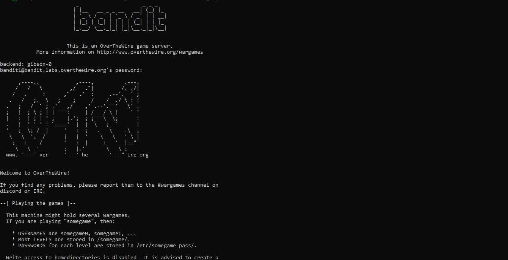

# Bandit Level 0 → Level 1

## Objective

The objective of this level is to establish a secure SSH connection to the Bandit server and retrieve the password required to access Bandit Level 1. This introductory challenge demonstrates the basics of connecting to a remote Linux machine, navigating the file system, and reading the contents of a file.

---

## Challenge Information

| Item | Value |
|------|-------|
| Game | OverTheWire Bandit |
| Level | 0 → 1 |
| Host | bandit.labs.overthewire.org |
| Port | 2220 |
| Username | bandit0 |
| Password | Redacted |

> **Note:** The password has been intentionally omitted to comply with the OverTheWire Bandit rules and to avoid publishing challenge spoilers.

---

## Prerequisites

Before attempting this level, ensure you have:

- A terminal (Linux, macOS, WSL, or Git Bash)
- An SSH client installed
- Internet connectivity
- Basic familiarity with Linux commands

---

## Skills Learned

- Connecting to a remote Linux server using SSH
- Authenticating with a username and password
- Understanding the Linux home directory
- Listing files using `ls`
- Reading file contents using `cat`
- Retrieving information stored in a text file

---

## Commands Used

### 1. Connect to the Bandit Server

```bash
ssh bandit0@bandit.labs.overthewire.org -p 2220
```

### Explanation

- `ssh` starts a secure remote shell session.
- `bandit0` is the username for Level 0.
- `bandit.labs.overthewire.org` is the remote server.
- `-p 2220` specifies the custom SSH port used by the Bandit server.

---

### 2. List the Files

```bash
ls
```

Output:

```text
readme
```

### Explanation

The `ls` command lists the contents of the current directory.

For this level, the home directory contains a single file named `readme`.

---

### 3. Read the Password File

```bash
cat readme
```

### Explanation

The `cat` command displays the contents of a file.

The `readme` file contains the password required to log in to **Bandit Level 1**.

> **Password Redacted:** The password has been removed from this repository to respect the OverTheWire rules.

---

## Solution Steps

1. Open a terminal.
2. Connect to the Bandit server.

```bash
ssh bandit0@bandit.labs.overthewire.org -p 2220
```

3. Enter the Level 0 password when prompted.
4. List the files in the home directory.

```bash
ls
```

5. Locate the `readme` file.
6. Display its contents.

```bash
cat readme
```

7. Save the password securely for use in the next level.

---

## Terminal Output

After successfully logging in, the server displays:

- The OverTheWire welcome banner
- General information about the Bandit server
- Rules for participating in the wargames
- Security recommendations
- Available debugging and security tools
- Helpful links to official documentation
- The Linux shell prompt

The complete terminal session (with the password removed) can be viewed in:

📄 **[Terminal Output](Terminal-output.txt)**

---

## Screenshots

### SSH Login



---

## Project Structure

```text
level-0/
├── README.md
├── Terminal-output.txt
└── Screenshots/
    └── 01-login.jpg
```

---

## Key Takeaways

- Learned how to establish a secure SSH connection.
- Understood the purpose of specifying a custom SSH port.
- Practiced logging into a remote Linux machine.
- Used `ls` to inspect directory contents.
- Used `cat` to display the contents of a file.
- Retrieved the password required for the next Bandit level.
- Learned the importance of keeping credentials and challenge passwords private.

---

## References

- OverTheWire Bandit: https://overthewire.org/wargames/bandit/
- OverTheWire Rules: https://overthewire.org/rules/
- OpenSSH Documentation: https://www.openssh.com/manual.html

---

## Disclaimer

This repository documents my learning journey through the OverTheWire Bandit wargame. Passwords and other challenge secrets have been intentionally omitted to respect the OverTheWire rules and to encourage others to solve the challenges independently.