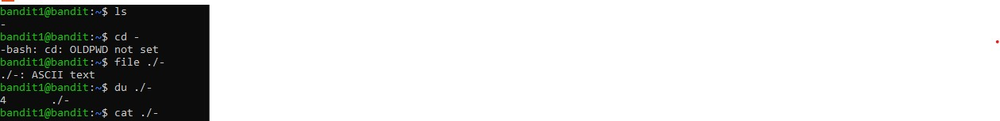

# Bandit Level 01 → Level 02

## Objective

The objective of this level is to learn how Linux handles files with special names. The password for **Bandit Level 02** is stored in a file named `-` located in the home directory. This challenge demonstrates how to correctly access files whose names would otherwise be interpreted as command-line options.

---

## Challenge Information

| Item | Value |
|------|------|
| Game | OverTheWire Bandit |
| Level | 01 → 02 |
| Host | bandit.labs.overthewire.org |
| Port | 2220 |
| Username | bandit1 |
| Password | Redacted |

> **Note:** The password has been intentionally omitted to respect the OverTheWire Bandit rules and avoid publishing challenge spoilers.

---

## Prerequisites

Before attempting this level, ensure you have:

- Completed **Bandit Level 00 → Level 01**
- Logged in as **bandit1**
- A basic understanding of Linux terminal commands
- An SSH client installed

---

## Skills Learned

- Working with files that have special names
- Understanding how Linux interprets `-` as a command option
- Using relative paths (`./`) to reference files
- Reading file contents using `cat`
- Identifying file types using `file`
- Checking disk usage using `du`

---

## Commands Used

### 1. List Available Files

```bash
ls
```

**Output**

```text
-
```

The `ls` command lists all files in the current directory. In this level, the only file is named `-`.

---

### 2. Attempt to Change Directory

```bash
cd -
```

**Output**

```text
-bash: cd: OLDPWD not set
```

The `cd -` command attempts to return to the previous working directory. Since no previous directory exists during this session, Bash displays the `OLDPWD not set` error.

---

### 3. Identify the File Type

```bash
file ./-
```

**Output**

```text
./-: ASCII text
```

The `file` command identifies the file as a plain ASCII text file.

---

### 4. Check Disk Usage

```bash
du ./-
```

**Output**

```text
4       ./-
```

The `du` command displays the amount of disk space used by the file.

---

### 5. Read the File

```bash
cat ./-
```

The `cat` command displays the contents of the file, revealing the password required to access **Bandit Level 02**.

> **Password Redacted:** The password has intentionally been removed from this repository to respect the OverTheWire Bandit rules.

---

### 6. Verify Current Directory

```bash
pwd
```

**Output**

```text
/home/bandit1
```

The `pwd` command displays the current working directory.

---

## Explanation

The file is named `-`, which is a special character commonly interpreted by Linux commands as an option or standard input.

For example,

```bash
cat -
```

does **not** read the file named `-`. Instead, `cat` waits for input from the keyboard (standard input).

To access the file correctly, specify its path:

```bash
cat ./-
```

Here:

- `.` represents the current directory.
- `./-` explicitly refers to the file named `-`.

This removes any ambiguity and allows the command to access the correct file.

---

## Solution Steps

1. Log in to the Bandit server as `bandit1`.
2. List the files using `ls`.
3. (Optional) Try `cd -` to understand how it behaves.
4. Verify the file type using `file ./-`.
5. Check the file's disk usage using `du ./-`.
6. Read the file using `cat ./-`.
7. Save the password securely and use it to log in to **Bandit Level 02**.

---

## Terminal Output

The following commands were executed during this level:

```bash
ls
cd -
file ./-
du ./-
cat ./-
pwd
```

The complete terminal session (with the password removed) can be viewed here:

📄 **[Terminal Output](Terminal-output.txt)**

---

## Screenshots

### Complete Terminal Session

The screenshot below shows the complete terminal session, including:

- Listing the files using `ls`
- Attempting `cd -`
- Checking the file type using `file`
- Viewing disk usage using `du`
- Reading the password using `cat`
- Displaying the current directory using `pwd`

> **Note:** The password has been redacted from the screenshot before uploading.



---

## Project Structure

```text
level-01/
├── README.md
├── Terminal-output.txt
└── screenshots/
    └── 01.jpg
```

---

## Key Takeaways

- Linux files can have special names such as `-`.
- Many commands interpret `-` as an option instead of a filename.
- Prefixing the filename with `./` tells Linux to treat it as a file path.
- The `cat` command displays the contents of a text file.
- The `file` command identifies the actual file type.
- The `du` command displays disk usage.
- The `pwd` command prints the current working directory.
- Understanding special filenames is an essential Linux skill and is frequently encountered in cybersecurity challenges.

---

## References

- OverTheWire Bandit: https://overthewire.org/wargames/bandit/
- OverTheWire Rules: https://overthewire.org/rules/
- GNU Coreutils Documentation: https://www.gnu.org/software/coreutils/

---

## Disclaimer

This repository documents my learning journey through the OverTheWire Bandit wargame. Passwords and other challenge secrets have been intentionally omitted to respect the OverTheWire rules and to encourage others to solve the challenges independently.