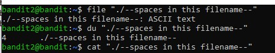
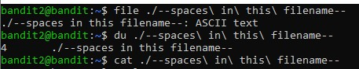

# Bandit Level 02 → Level 03

## Objective

The objective of this level is to learn how Linux handles filenames containing spaces. The password for **Bandit Level 03** is stored in a file named `--spaces in this filename--` located in the home directory. This challenge demonstrates two common ways to access files whose names contain spaces: using **double quotes** and **escape characters**.

---

## Challenge Information

| Item | Value |
|------|------|
| Game | OverTheWire Bandit |
| Level | 02 → 03 |
| Host | bandit.labs.overthewire.org |
| Port | 2220 |
| Username | bandit2 |
| Password | Redacted |

> **Note:** The password has been intentionally omitted to respect the OverTheWire Bandit rules and avoid publishing challenge spoilers.

---

## Prerequisites

Before attempting this level, ensure you have:

- Completed **Bandit Level 01 → Level 02**
- Logged in as **bandit2**
- A basic understanding of Linux terminal commands
- An SSH client installed

---

## Skills Learned

- Working with filenames containing spaces
- Understanding how the Linux shell parses command-line arguments
- Using double quotes to preserve filenames with spaces
- Using escape characters (`\`) to handle spaces
- Reading files using `cat`
- Identifying file types using `file`
- Checking disk usage using `du`

---

## Commands Used

### 1. List Available Files

```bash
ls
```

**Output**

```text
--spaces in this filename--
```

The `ls` command lists the files in the current directory.

---

## Method 1 – Using Double Quotes

### Identify the File Type

```bash
file "./--spaces in this filename--"
```

**Output**

```text
./--spaces in this filename--: ASCII text
```

---

### Check Disk Usage

```bash
du "./--spaces in this filename--"
```

**Output**

```text
4       ./--spaces in this filename--
```

---

### Read the File

```bash
cat "./--spaces in this filename--"
```

The command displays the contents of the file and reveals the password for **Bandit Level 03**.

> **Password Redacted:** The password has intentionally been removed from this repository to respect the OverTheWire Bandit rules.

---

## Method 2 – Using Escape Characters

### Identify the File Type

```bash
file ./--spaces\ in\ this\ filename--
```

**Output**

```text
./--spaces in this filename--: ASCII text
```

---

### Check Disk Usage

```bash
du ./--spaces\ in\ this\ filename--
```

**Output**

```text
4       ./--spaces in this filename--
```

---

### Read the File

```bash
cat ./--spaces\ in\ this\ filename--
```

The command displays the contents of the file and reveals the password for **Bandit Level 03**.

> **Password Redacted:** The password has intentionally been removed from this repository to respect the OverTheWire Bandit rules.

---

### Verify Current Directory

```bash
pwd
```

**Output**

```text
/home/bandit2
```

The `pwd` command prints the current working directory.

---

## Explanation

The filename contains spaces, so the Linux shell interprets each word as a separate command-line argument unless the spaces are handled correctly.

For example,

```bash
cat --spaces in this filename--
```

does **not** work because the shell interprets `--spaces`, `in`, `this`, and `filename--` as separate arguments.

### Solution 1: Using Double Quotes

```bash
cat "./--spaces in this filename--"
```

Everything inside the quotation marks is treated as a single filename.

### Solution 2: Using Escape Characters

```bash
cat ./--spaces\ in\ this\ filename--
```

Each backslash (`\`) escapes the following space, allowing the shell to interpret the entire filename as one argument.

Both approaches are correct and commonly used in Linux.

---

## Solution Steps

1. Log in to the Bandit server as **bandit2**.
2. List the files using `ls`.
3. Verify the file type using either of the following:

```bash
file "./--spaces in this filename--"
```

or

```bash
file ./--spaces\ in\ this\ filename--
```

4. Check the file size using:

```bash
du "./--spaces in this filename--"
```

or

```bash
du ./--spaces\ in\ this\ filename--
```

5. Read the file using:

```bash
cat "./--spaces in this filename--"
```

or

```bash
cat ./--spaces\ in\ this\ filename--
```

6. Save the password securely and use it to log in to **Bandit Level 03**.

---

## Terminal Output

Two terminal sessions are included to demonstrate both methods of accessing the file.

### Method 1 – Using Double Quotes

📄 **[Terminal-output01.txt](Terminal-output01.txt)**

### Method 2 – Using Escape Characters

📄 **[Terminal-output02.txt](Terminal-output02.txt)**

---

## Screenshots

### Method 1 – Using Double Quotes

> **Note:** The password has been redacted from the screenshot before uploading.



---

### Method 2 – Using Escape Characters

> **Note:** The password has been redacted from the screenshot before uploading.



---

## Project Structure

```text
level-02/
├── README.md
├── Terminal-output01.txt
├── Terminal-output02.txt
└── Screenshots/
    ├── 02-using-quotes.jpg
    └── 02-using-escape.jpg
```

> Replace the screenshot filenames above if your actual filenames are different.

---

## Key Takeaways

- Linux filenames can contain spaces.
- The shell splits command-line arguments at spaces unless instructed otherwise.
- Double quotes preserve the filename as a single argument.
- Escape characters (`\`) allow spaces to be interpreted literally.
- Both methods are equally valid and widely used in Linux.
- `file` identifies the file type.
- `du` displays the disk usage of a file.
- `cat` displays the contents of a text file.
- Understanding how the shell interprets filenames is an essential Linux skill and is frequently encountered in cybersecurity environments.

---

## References

- OverTheWire Bandit: https://overthewire.org/wargames/bandit/
- OverTheWire Rules: https://overthewire.org/rules/
- GNU Coreutils Documentation: https://www.gnu.org/software/coreutils/

---

## Disclaimer

This repository documents my learning journey through the OverTheWire Bandit wargame. Passwords and other challenge secrets have been intentionally omitted to respect the OverTheWire rules and to encourage others to solve the challenges independently.