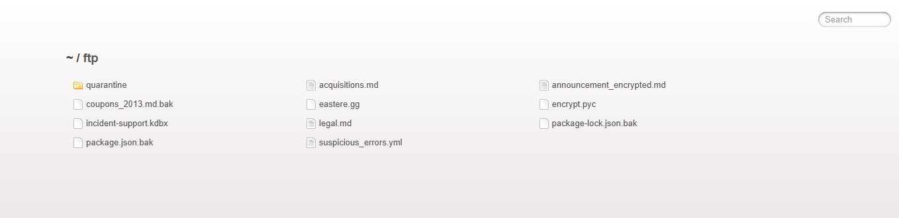
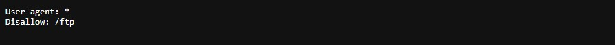
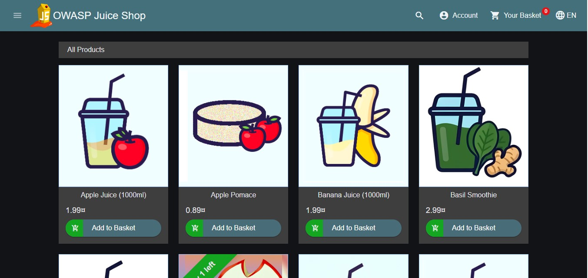

# OWASP Juice Shop — DIRB Scan & Recon Notes

- **Date:** 2026-06-21
- **Target:** http://localhost:3000/ (Docker, local)
- **Wordlist:** common.txt (4612 words) · 9 paths found
- **Raw data:** [scan-output.txt](scan-output.txt) · [response bodies](raw-responses.txt)

---

## Summary
`robots.txt` pointed at a disallowed `/ftp` path, which exposed backup files and a credential database. A separate check of `/redirect` found a broken validation function — actively being investigated below.

---

## Findings overview

| Priority | Path | Status | Note |
|---|---|---|---|
| 🔴 | `/redirect` | 500 → 406 | Allow-list confirmed, under investigation |
| 🔴 | `/ftp` | 200 | Backup files + exposed KeePass database |
| 🟡 | `/profile` | 500 | Leaks Express version + internal Docker IP |
| 🟢 | `/robots.txt` | 200 | `Disallow: /ftp` — the lead that started this |
| 🟢 | `/promotion`, `/video`, `/Video` | 200 | Same OWASP intro video, dead end |
| 🟢 | `/assets`, `/media` | 301 | Redirects, nothing at destination |

---

## Active investigation — `/redirect`

| # | Attempt | Result |
|---|---|---|
| 1 | `/redirect` (no parameter) | 500 — crash in `isRedirectAllowed()`, expected a parameter |
| 2 | `/redirecthello`, `/redirect3` (param appended to path, wrong syntax) | Didn't reach the backend route — caught by the SPA's own router, just showed the product page |
| 3 | `/redirect?to=https://google.com` (correct query string) | 406 — "Unrecognized target URL for redirect" |

**What this confirms:** the route checks the `to` value against a server-side allow-list — it's not blindly redirecting anywhere.

**Next:** Juice Shop is open source. Check `routes/redirect.js` on GitHub for the allow-list itself rather than guessing more URLs.

---

## `/ftp` — exposed files

```
quarantine6/5/2026
acquisitions.md
announcement_encrypted.md
coupons_2013.md.bak
eastere.gg
encrypt.pyc
incident-support.kdbx
legal.md
package-lock.json.bak
package.json.bak
suspicious_errors.yml
```
`.bak` files are worth diffing against the live versions. `incident-support.kdbx` is an exposed password database.

---

## Screenshots




---

## Takeaways
- Check `robots.txt` first — it pointed straight at the most interesting path.
- A path segment and a query parameter are not the same thing — `/redirect3` ≠ `/redirect?to=3`.
- When a black-box test hits a clear allow-list rejection and the target is open source, reading the source beats guessing.